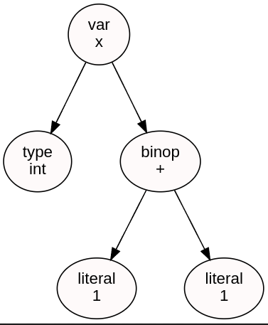
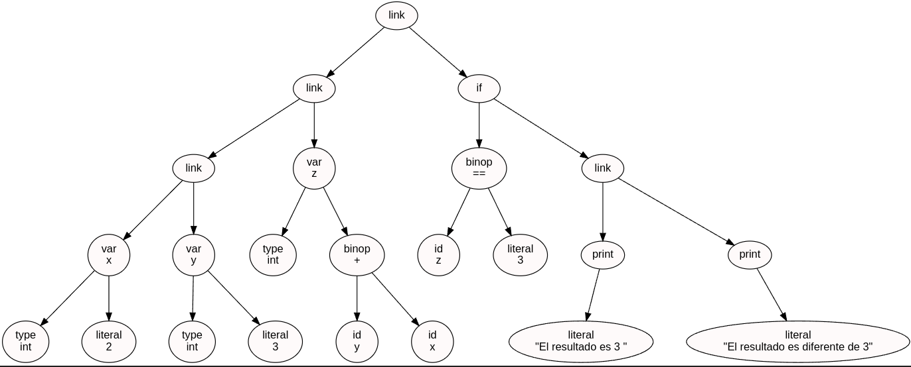

# UNIVERSIDAD DE SAN CARLOS DE GUATEMALA  
## FACULTAD DE INGENIERÍA  
### ORGANIZACION DE LENGUAJES Y COMPILADORES 2 

**CATEDRÁTICO:** Ing. David Estuardo Morales 
**TUTOR ACADÉMICO:** Ronaldo Javier Posadas Guerra 

---

**Jeremy Estuado Orellana Aldana**  
**CARNÉ:** 202300644
**SECCIÓN:** N 

**Guatemala, 17 de septiembre del 2025**


## OBJETIVOS DEL SISTEMA

### GENERAL  
Explicar como los pasos que se siguieron para poder llegar a la solucion.

### ESPECÍFICOS  
- Explicar como se formo la gramatica
- Explicar como se incorporo la gramatica al codigo.

## INTRODUCCIÓN

Este manual técnico describe el desarrollo de un proyecto en el campo de la ingeniería en Ciencias y Sistemas, utilizando el lenguaje de programación C. El objetivo principal de este proyecto fue implementar un interprete del lenguaje JAVA , capaz de procesar y evaluar los datos contenidos en archivos con formato .USL para lograr interpretar el codigo. A lo largo del documento, se detallarán los aspectos técnicos involucrados en el diseño.


## REQUISITOS DEL SISTEMA

Para la utilización del programa se necesitan ciertos requisitos, los cuales son:

### Sistema Operativo  
Linux Ubuntu.  
**Descarga disponible para [Linux Ubuntu](https://ubuntu.com/download)**.

### Programa Utilizado  
Se usó Visual Studio Code, un editor de código que permite desarrollar en varios lenguajes de programación. Es fundamental descargar la versión adecuada para tu sistema operativo y para el tipo de computadora .
**Enlace de descarga para [Visual Studio Code](https://code.visualstudio.com/Download)**.

### C  
C es un lenguaje de programación de nivel medio diseñado para el desarrollo de sistemas operativos, software de propósito general y aplicaciones que requieren eficiencia y control cercano del hardware. 
**Enlace de descarga para [C](https://visualstudio.microsoft.com/es/vs/features/cplusplus/)**.


### Herramientas utilizadas  
#### Bison

Herramienta que genera analizadores sintácticos. Toma los tokens que le da Flex y verifica si cumplen con las reglas de la gramática definida, construyendo la estructura del lenguaje.

#### Flex

Herramienta que sirve para generar analizadores léxicos. Se encarga de leer el texto de entrada y dividirlo en tokens (palabras clave, números, símbolos, etc.).

---

**Es fundamental señalar que para un uso óptimo de estos programas es necesario disponer de una computadora actualizada y estable.**


## Analizador Lexico
Para el analisis lexico se utilizo la herramienta flex con el siguiente codigo 

```lex
%{
#include "parser.tab.h"
#include <stdio.h>
#include <string.h>
#include <stdlib.h>

void yyerror(const char *s); 

int yycolumn = 1;

#define YY_USER_ACTION                                   \
    yylloc.first_line   = yylineno;                      \
    yylloc.first_column = yycolumn;                      \
    yylloc.last_line    = yylineno;                      \
    yylloc.last_column  = yycolumn + yyleng - 1;         \
    yycolumn           += yyleng;
%}

%option noyywrap yylineno

%x COMMENT2 COMMENTLINEA
espacios                [ \t]+

%%

"//"                     BEGIN(COMMENTLINEA);
<COMMENTLINEA>[^\n\r]+   /* ignorar  */
<COMMENTLINEA><<EOF>>    yyerror("EOF in line comment");
<COMMENTLINEA>[\n\r]     BEGIN(INITIAL);

"/*"                     BEGIN(COMMENT2);
<COMMENT2>[^*\n\r]+      /* ignorar */
<COMMENT2>[\n\r]         ++yylineno;
<COMMENT2><<EOF>>        yyerror("EOF in block comment");
<COMMENT2>"*/"           BEGIN(INITIAL);
<COMMENT2>.              /* cualquier otro char  */

"System.out.println"     { return TK_PRINT; }
"Integer.parseInt"       { return TK_PARSEINT; }
"Float.parseFloat"       { return TK_PARSEFLOAT; }
"Double.parseDouble"     { return TK_PARSEDOUBLE; }
"String.valueOf"         { return TK_VALUEOF; }
"String.join"            { return TK_JOIN; }
"Arrays.indexOf"         { return TK_INDEXOF;}
".add"                   { return TK_ADD; }
"final"                  { return TK_FINAL; }

"int"                    { return TK_INT; }
"float"                  { return TK_FLOAT; }
"String"                 { return TK_STRING; }
"boolean"                { return TK_BOOL; }
"char"                   { return TK_CHAR; }
"double"                 { return TK_DOUBLE; }
".equals"                { return TK_EQUALS;}
"if"                     { return TK_IF; }
".length"                { return TK_LENGTH;}
"else"                   { return TK_ELSE; }
"while"                  { return TK_WHILE; }
"for"                    { return TK_FOR; }
"do"                     { return TK_DO; }
"switch"                 { return TK_SWITCH; }
"case"                   { return TK_CASE; }
"break"                  { return TK_BREAK; }
"default"                { return TK_DEFAULT; }
"continue"               { return TK_CONTINUE; }
"return"                 { return TK_RETURN; }
"void"                   { return TK_VOID; }
"main"                   { return TK_MAIN; }
"new"                    { return TK_NUEVO; }

"=="                     { return TK_IGUAL_IGUAL; }
"!="                     { return TK_DIFERENTE; }
">="                     { return TK_MAYOR_IGUAL; }
"<="                     { return TK_MENOR_IGUAL; }
">"                      { return TK_MAYOR; }
"<"                      { return TK_MENOR; }

"&&"                     { return TK_AND; }
"||"                     { return TK_OR; }
"!"                      { return TK_NOT; }

"="                      { return TK_IGUAL; }
"+="                     { return TK_MAS_IGUAL; }
"-="                     { return TK_MENOS_IGUAL; }
"*="                     { return TK_POR_IGUAL; }
"/="                     { return TK_DIVIDIR_IGUAL; }
"%="                     { return TK_PORCENTAJE_IGUAL; }
"&="                     { return TK_AND_IGUAL; }
"|="                     { return TK_OR_IGUAL; }
"^="                     { return TK_POTENCIA_IGUAL; }
">>="                    { return TK_MAYOR_MAYOR_IGUAL; }
"<<="                    { return TK_MENOR_MENOR_IGUAL; }

":="                     { return TK_DOSPUNTOS_IGUAL; }

"("                      { return TK_PA; }
")"                      { return TK_PC; }
"["                      { return TK_CA; }
"]"                      { return TK_CC; }
"{"                      { return TK_LLA; }
"}"                      { return TK_LLC; }
";"                      { return TK_PTCOMA; }
":"                      { return TK_DOSPUNTOS; }
","                      { return TK_COMA; }

"+"                      { return TK_SUMA; }
"-"                      { return TK_RESTA; }
"*"                      { return TK_MULTIPLICACION; }
"/"                      { return TK_DIVISION; }
"%"                      { return TK_MODULAR; }
[0-9]+"."[0-9]+[fF]      { yylval.str = strdup(yytext); return  DECIMAL; }
[0-9]+"."[0-9]+          { yylval.str = strdup(yytext); return DOUBLE;}
[0-9]+                   { yylval.str = strdup(yytext); return INT; }
\"([^"\n])*\"            { yylval.str = strdup(yytext); return CADENA; }
\'[^\']\'                { yylval.str = strdup(yytext); return CARACTER; }
"true"|"false"           { yylval.str = strdup(yytext); return BOOL; }
[a-zA-Z_][a-zA-Z0-9_]*   { yylval.str = strdup(yytext); return ID; }
{espacios}               /* ignorar */
[\n\r]                   { yylineno++; yycolumn=1; }

.                        { yyerror("Illegal input"); }

%%
```

### Analizador Sintactico

Para el analisis sintactico se utilizo la herramienta Bison, con la siguiente gramatica en formato bnf:


```
<inicio> ::= <listainstrucciones>

<listainstrucciones> ::= <listainstrucciones> <instruccion>
                       | <instruccion>

<instruccion> ::= <IMPRIMIR>
                | <DECLARACION>
                | <ASIGNACION>
                | <IF>
                | <INCREMENTO_DECREMENTO> ";"
                | <SWITCH>
                | <BREAK>
                | <WHILE>
                | <FOR>
                | <CONTINUAR>
                | <RETORNAR>
                | <DECLARAR_FUNCION>
                | <LLAMADA_PROCEDIMIENTO>
                | <DECLARAR_VECTOR>
                | ID ".add" "(" <expr> ")" ";"

; ----------------------------
; DECLARACIONES
; ----------------------------

<DECLARACION> ::= <TIPO> ID "=" <expr> ";"
                | <TIPO> ID ";"
                | "final" <TIPO> ID "=" <expr> ";"

<TIPO> ::= "int"
         | "string"
         | "float"
         | "bool"
         | "char"
         | "double"

; ----------------------------
; VECTORES
; ----------------------------

<DECLARAR_VECTOR> ::= <TIPO> "[" "]" ID "=" "new" <TIPO> "[" <expr> "]" ";"
                    | <TIPO> "[" "]" ID "=" "{" <VALORES> "}" ";"

; ----------------------------
; ASIGNACIONES (incluye arreglo 1D)
; ----------------------------

<ASIGNACION> ::= <expr> <OP_ASIGNACION> <expr> ";"
               | ID "[" <expr> "]" <OP_ASIGNACION> <expr> ";"

<OP_ASIGNACION> ::= "=" | "+=" | "-=" | "*=" | "/=" | "%="
                  | "&=" | "|=" | "^=" | ">>=" | "<<=" | ":="

; ----------------------------
; PRINT
; ----------------------------

<IMPRIMIR> ::= "System.out.println" "(" <expr> ")" ";"

; ----------------------------
; ++ / --
; ----------------------------

<INCREMENTO_DECREMENTO> ::= <expr> "++"
                          | <expr> "--"

; ----------------------------
; IF / ELSE (incluye else-if)
; ----------------------------

<IF> ::= "if" "(" <expr> ")" "{" <listainstrucciones> "}"
       | "if" "(" <expr> ")" "{" <listainstrucciones> "}" "else" "{" <listainstrucciones> "}"
       | "if" "(" <expr> ")" "{" <listainstrucciones> "}" "else" <IF>

; ----------------------------
; SWITCH / CASE
; ----------------------------

<SWITCH> ::= "switch" "(" <expr> ")" "{" <CASES> "}"

<CASES> ::= <CASE> <CASES>
          | <CASE>

<CASE> ::= "case" <expr> ":" <listainstrucciones>
         | "default" ":" <listainstrucciones>

; ----------------------------
; WHILE / FOR / BREAK / CONTINUE / RETURN
; ----------------------------

<WHILE> ::= "while" "(" <expr> ")" "{" <listainstrucciones> "}"

<FOR> ::= "for" "(" <DECLARACION> <expr> ";" <INCREMENTO_DECREMENTO> ")" "{" <listainstrucciones> "}"

<BREAK> ::= "break" ";"

<CONTINUAR> ::= "continue" ";"

<RETORNAR> ::= "return" <expr> ";"
             | "return" ";"

; ----------------------------
; FUNCIONES
; ----------------------------

<DECLARAR_FUNCION> ::= <TIPO> ID "(" <PARAMETROS> ")" "{" <listainstrucciones> "}"
                     | "void" ID "(" <PARAMETROS> ")" "{" <listainstrucciones> "}"

<PARAMETROS> ::= <TIPO> ID "," <PARAMETROS>
               | <TIPO> ID
               | /* vacío */

<LLAMADA_PROCEDIMIENTO> ::= ID "(" <VALORES> ")" ";"

; ----------------------------
; EXPRESIONES
; ----------------------------

<expr> ::= "(" <expr> ")"
         | "Integer.parseInt" "(" <expr> ")"
         | "Float.parseFloat" "(" <expr> ")"
         | "Double.parseDouble" "(" <expr> ")"
         | "String.valueOf" "(" <expr> ")"
         | "String.join" "(" <expr> "," <VALORES> ")"
         | "(" <TIPO> ")" <expr>              ; casteo
         | "Arrays.indexOf" "(" <expr> "," <expr> ")"
         | "-" <expr>                         ; UMINUS
         | INT
         | DECIMAL
         | CARACTER
         | CADENA
         | BOOL
         | DOUBLE
         | ID
         | <ARITMETICOS>
         | <RELACIONALES>
         | <LOGICOS>
         | <LLAMADA_FUNCION>
         | ID "[" <expr> "]"                  ; acceso vector
         | ID ".length"                       ; length (1D)

; Binarias aritméticas
<ARITMETICOS> ::= <expr> "+" <expr>
                | <expr> "-" <expr>
                | <expr> "*" <expr>
                | <expr> "/" <expr>
                | <expr> "%" <expr>

; Binarias relacionales / equals(...)
<RELACIONALES> ::= <expr> "==" <expr>
                 | <expr> ".equals" "(" <expr> ")"
                 | <expr> "!=" <expr>
                 | <expr> ">=" <expr>
                 | <expr> "<=" <expr>
                 | <expr> ">" <expr>
                 | <expr> "<" <expr>

; Lógicas
<LOGICOS> ::= <expr> "&&" <expr>
            | <expr> "||" <expr>
            | "!" <expr>

; Llamada función (expresión)
<LLAMADA_FUNCION> ::= ID "(" <VALORES> ")"

; Lista de valores (args/inicializadores)
<VALORES> ::= <expr> "," <VALORES>
            | <expr>
            | /* vacío */

```


### AST

Para el ast se tuvo que crear una estructura de tipo ASTNode:
```
struct ASTNode {
    char* kind;
    char* value;
    struct ASTNode* left;
    struct ASTNode* right;
};
```
y se grafica de la siguiente forma para la expresion int x = 1 + 1:


### Simbolo y entorno

Para manejar la tabla de simbolo se creo la estructura Symbol:

```
typedef struct symbol {
    char* id;
    void* valor;
    Tipo tipo;
    struct symbol* siguiente; 
    int constante;

    int   es_arreglo; 
    int   dimensiones;       
    int   longitud;        
    int   filas;     
    int   columnas;
} symbol;
```

y para manajar el entorno se creo la estructura entorno:

```
typedef struct entorno {
    struct entorno* anterior; 
    symbol* tabla[HASH_SIZE]; // HashMap
    funcion* funs[HASH_SIZE];
} entorno;
```

### Interprete

Para ir recorriendo los nodos del ast usaremos interprete, donde su codigo es este:

```
#include "ejecutar.h"
#include "entorno.h"
#include "symbol.h"
#include "./aritmetico.h"
#include "./literal.h"
#include "./id.h"
#include "./relacional.h"
#include "./casteo.h"
#include "./logico.h"
#include "./length.h"
#include "./llamada_funcion.h"
#include "./join.h"
#include "./parser.h"
#include "./vector_index.h"
#include "./indexOf.h"
#include "../instrucciones/imprimir.h"
#include "../instrucciones/declarar_var.h"
#include "../instrucciones/asignacion.h"
#include "../instrucciones/if.h"
#include "../instrucciones/incremento_decremento.h"
#include "../instrucciones/switch.h"
#include "../instrucciones/while.h"
#include "../instrucciones/break.h"
#include "../instrucciones/continuar.h"
#include "../instrucciones/retornar.h"
#include "../instrucciones/for.h"
#include "../instrucciones/declarar_funcion.h"
#include "../instrucciones/declarar_parametros.h"
#include "../instrucciones/declarar_vector.h"
#include "../instrucciones/array_add.h"
#include <stdlib.h>
#include <stdio.h>
#include <string.h>
#include <ctype.h>
#include <math.h>

TipoRetorno ejecutar(struct ASTNode *node, struct entorno *entorno)
{
    TipoRetorno res;
    res.valor = NULL;
    res.tipo = TIPO_NULO;
    res.control = CTRL_NORMAL;

    if (!node)
        return res;

    // printf("Ejecutando nodo: %s\n", node->kind);

    if (strcmp(node->kind, "literal") == 0)
    {
        res = ejecutarLiteral(node->value);
    }
    else if (strcmp(node->kind, "id") == 0)
    {
        res = ejecutarId(entorno, node->value);
    }
    else if (strcmp(node->kind, "binop") == 0)
    {
        TipoRetorno exp1 = ejecutar(node->left, entorno);
        TipoRetorno exp2 = ejecutar(node->right, entorno);
        if (strcmp(node->value, "+") == 0 || strcmp(node->value, "-") == 0 || strcmp(node->value, "*") == 0 || strcmp(node->value, "/") == 0 || strcmp(node->value, "%") == 0)
        {
            res = ejecutarAritmetico(node->value, exp1, exp2);
        }
        else if (strcmp(node->value, "==") == 0 || strcmp(node->value, "!=") == 0 || strcmp(node->value, "<") == 0 || strcmp(node->value, "<=") == 0 || strcmp(node->value, ">") == 0 || strcmp(node->value, ">=") == 0)
        {
            TipoRetorno exp1 = ejecutar(node->left, entorno);
            TipoRetorno exp2 = ejecutar(node->right, entorno);
            res = ejecutarRelacional(node->value, exp1, exp2);
        }
        else if (strcmp(node->value, "&&") == 0 || strcmp(node->value, "||") == 0)
        {
            res = ejecutarLogico(node->value, exp1, exp2);
        }

        else
        {
            printf("Error: operación binaria no soportada: %s\n", node->value);
            return res;
        }
    }
    else if (strcmp(node->kind, "unop") == 0)
    {
        TipoRetorno val = ejecutar(node->left, entorno);
        if (strcmp(node->value, "-") == 0 && val.tipo == TIPO_ENTERO)
        {
            int *p = malloc(sizeof(int));
            *p = -(*(int *)val.valor);
            res.tipo = TIPO_ENTERO;
            res.valor = p;
            return res;
        }
        else if (strcmp(node->value, "-") == 0 && val.tipo == TIPO_DOUBLE)
        {
            double *p = malloc(sizeof(double));
            *p = -(*(double *)val.valor);
            res.tipo = TIPO_DOUBLE;
            res.valor = p;
            return res;
        }
        else if (strcmp(node->value, "-") == 0 && val.tipo == TIPO_DECIMAL)
        {
            float *p = malloc(sizeof(float));
            *p = -(*(float *)val.valor);
            res.tipo = TIPO_DECIMAL;
            res.valor = p;
            return res;
        }
        TipoRetorno exp1 = ejecutar(node->left, entorno);
        if (strcmp(node->value, "!") == 0)
        {
            TipoRetorno nulo = {NULL, TIPO_NULO};
            res = ejecutarLogico(node->value, exp1, nulo);
        }
        else
        {
            printf("Error: operación unaria no soportada: %s\n", node->value);
            return res;
        }
    }
    else if (strcmp(node->kind, "print") == 0)
    {
        TipoRetorno valor = ejecutar(node->left, entorno);
        ejecutarImprimir(valor);
    }
    else if (strcmp(node->kind, "var") == 0)
    {
        ejecutarDeclarar(node, entorno, 0);
    }
    else if (strcmp(node->kind, "var_const") == 0)
    {
        ejecutarDeclarar(node, entorno, 1);
    }
    else if (strcmp(node->kind, "assign") == 0)
    {
        res = ejecutarAsignacion(node, entorno);
    }
    else if (strcmp(node->kind, "cast") == 0)
    {
        TipoRetorno valor = ejecutar(node->left, entorno);
        const char *tipoDestino = node->right ? node->right->value : NULL;
        res = ejecutarCasteo(tipoDestino, valor);
    }
    else if (strcmp(node->kind, "if") == 0)
    {

        res = ejecutarIf(node, entorno);
    }
    else if (strcmp(node->kind, "incremento_decremento") == 0)
    {
        res = ejecutarIncremento_Decremento(node, entorno);
    }
    else if (strcmp(node->kind, "switch") == 0)
    {
        ejecutarSwitch(node, entorno);
    }
    else if (strcmp(node->kind, "while") == 0)
    {
        ejecutarWhile(node, entorno);
    }
    else if (strcmp(node->kind, "for") == 0)
    {
        ejecutarFor(node, entorno);
    }
    else if (strcmp(node->kind, "break") == 0)
    {
        res = ejecutarBreak();
    }
    else if (strcmp(node->kind, "continue") == 0)
    {
        res = ejecutarContinuar();
    }
    else if (strcmp(node->kind, "return") == 0)
    {
        res = ejecutarRetornar(node, entorno);
    }
    else if (strcmp(node->kind, "funcion_decl") == 0)
    {

        res = ejecutarDeclararFuncion(node, entorno);
    }
    else if (strcmp(node->kind, "parametro") == 0)
    {

        ejecutarDeclararParametros(node, entorno);
    }
    else if (strcmp(node->kind, "llamada_funcion") == 0)
    {
        res = ejecutarLlamadaFuncion(node, entorno);
    }
    else if (strcmp(node->kind, "parser") == 0)
    {
        res = ejecutarParser(node, entorno);
    }
    else if (strcmp(node->kind, "vector_decl") == 0)
    {
        ejecutarDeclararVector(node, entorno);
    }
    else if (strcmp(node->kind, "vector_decl_init") == 0)
    {
        ejecutarDeclararVector(node, entorno);
    }
    else if (strcmp(node->kind, "index1") == 0)
    {

        res = ejecutarVectorGet(node, entorno);
    }
    else if (strcmp(node->kind, "array_length") == 0)
    {

        res = ejecutarLength(node, entorno);
    }
    else if (strcmp(node->kind, "join") == 0)
    {

        res = ejecutarJoin(node, entorno);
    }
    else if (strcmp(node->kind, "array_indexof") == 0)
    {
        res = ejecutarIndexOf(node, entorno);
    }
    else if (strcmp(node->kind, "array_add") == 0)
    {
        ejecutarArrayAdd(node, entorno);
    }
    else if (strcmp(node->kind, "link") == 0)
    {
        TipoRetorno r1 = ejecutar(node->left, entorno);

        if (r1.control != CTRL_NORMAL)
            return r1;

        TipoRetorno r2 = ejecutar(node->right, entorno);
        return r2;
    }

    return res;
}
```


## Casos de prueba
1. Usaremos la entrada:
```
int x = 2;
int y = 3;
int z = y + x;
if (z == 3){
    System.out.println("El resultado es 3 ");
} else {
    System.out.println("El resultado es diferente de 3");
}
```
2. La salida en consola sera esta:

```
Analisis completado.
El resultado es diferente de 3

```

3. El ast se graficara de la siguiente forma:
