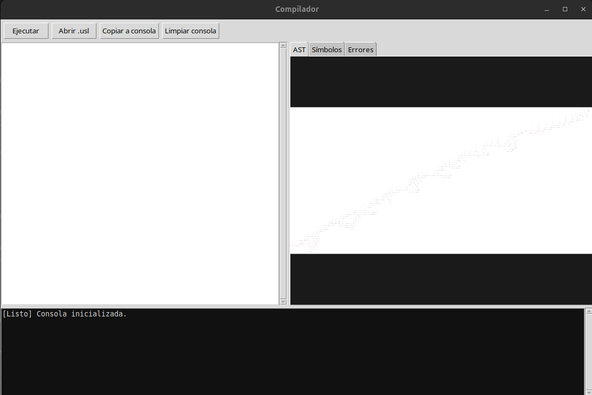
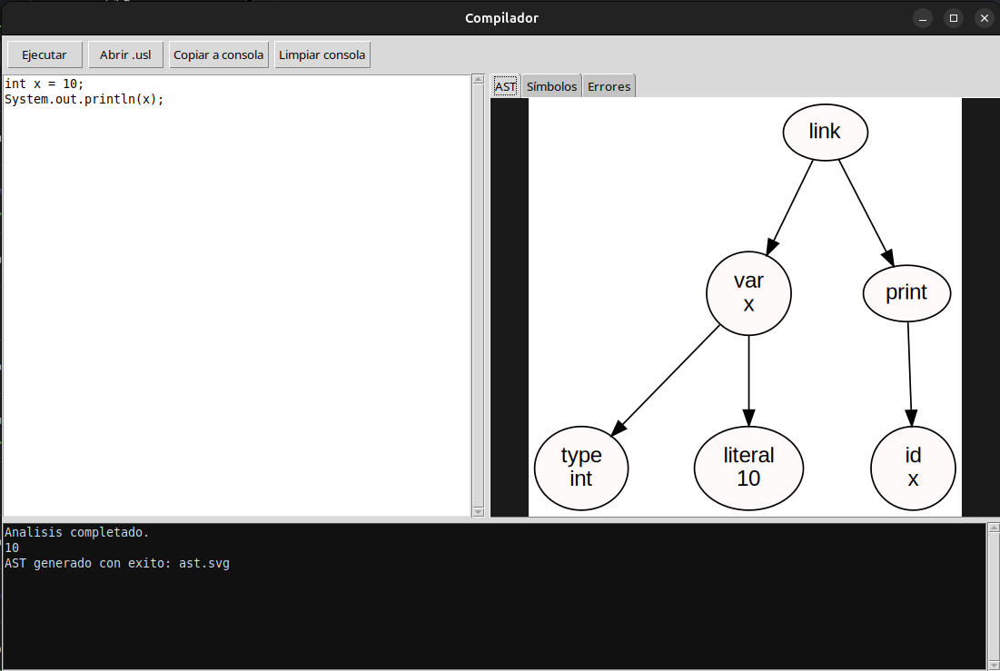
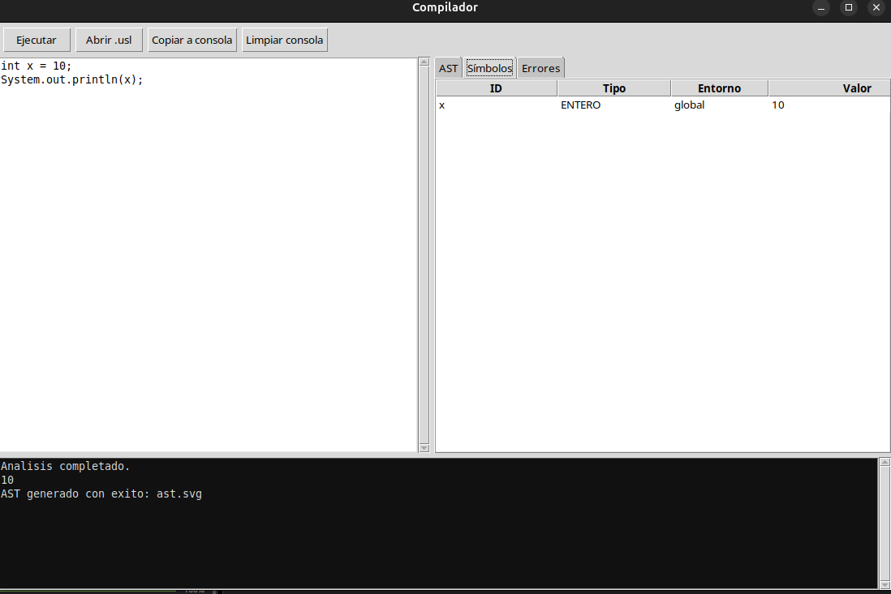
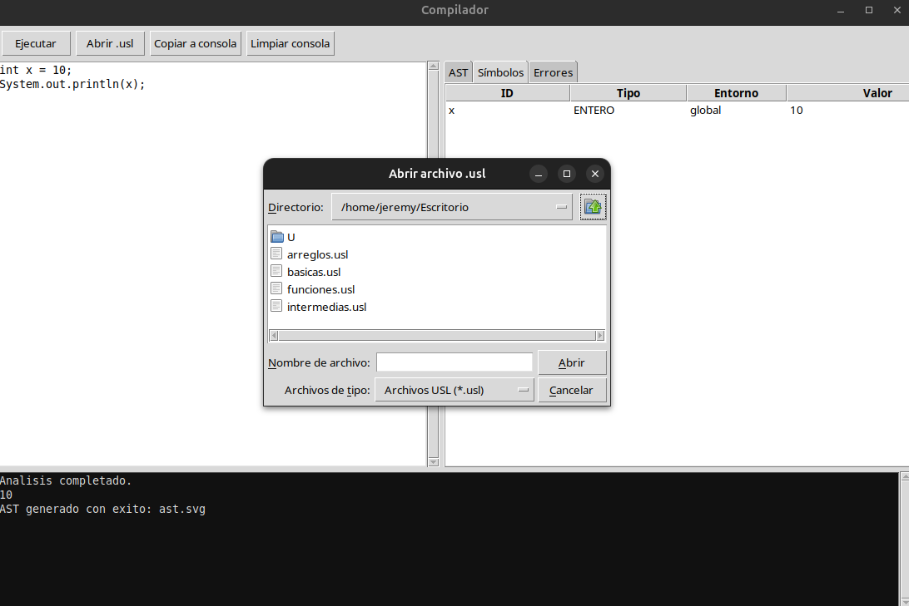
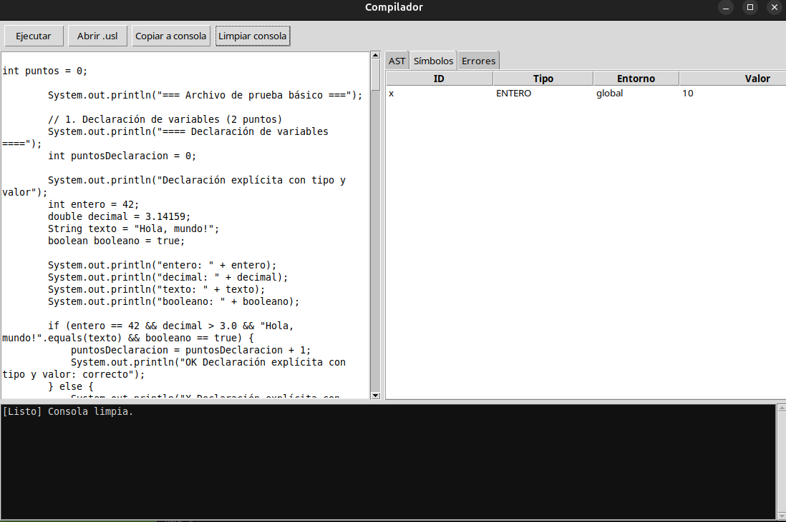
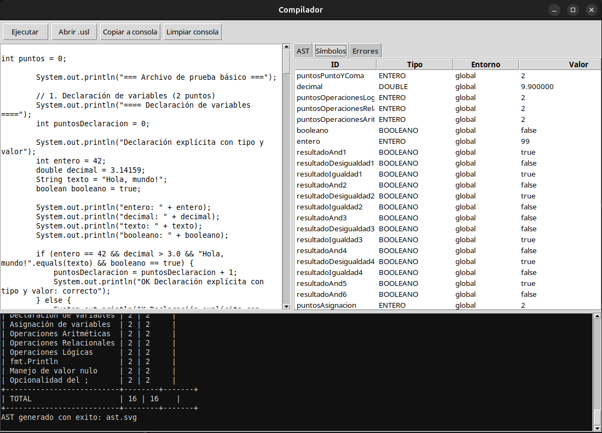

# UNIVERSIDAD DE SAN CARLOS DE GUATEMALA  
## FACULTAD DE INGENIERÍA  
### ORGANIZACION DE LENGUAJES Y COMPILADORES 2   

**CATEDRÁTICO:** Ing. David Estuardo Morales 
**TUTOR ACADÉMICO:** Ronaldo Javier Posadas Guerra  

---

**Jeremy Estuado Orellana Aldana**  
**CARNÉ:** 202300644
**SECCIÓN:** N  

**Guatemala, 17 de septiembre del 2024**

## OBJETIVOS DEL SISTEMA

### GENERAL  
Aplicar lo aprendido en las clases de laboratorio usando el lenguaje C.

### ESPECÍFICOS  
- Usar la nueva sintaxis para crear el proyecto asignado.  
- Mostrar los pasos requeridos para usar y ejecutar el programa.

## INTRODUCCIÓN

Los proyectos en ingeniería en Ciencias y Sistemas son esenciales porque nos ayudan a desarrollar habilidades resolviendo proyectos. Por eso se realizó el primer proyecto, usando C, que consistió en crear un interprete para java y evaluar los datos de un archivo .USL

## INFORMACIÓN DEL SISTEMA

El programa fue desarrollado en C utilizando Visual Studio Code como entorno de desarrollo, con el apoyo de las herramientas Flex y Bison para la construcción del analizador léxico y sintáctico.

Su objetivo es implementar un intérprete del lenguaje Java, capaz de procesar archivos con extensión .usl.

El sistema realiza las siguientes funciones:

Análisis léxico: identifica los tokens presentes en el código fuente (palabras reservadas, identificadores, operadores, literales, etc.).

Análisis sintáctico: valida que las estructuras del programa cumplan con las reglas de la gramática definida.

Construcción del Árbol de Sintaxis Abstracta (AST): organiza el código en una representación jerárquica que facilita su interpretación.

Ejecución: interpreta las instrucciones definidas en el archivo .usl, permitiendo declarar variables, realizar operaciones aritméticas y lógicas, manejar estructuras de control (if, while, for, switch), trabajar con funciones, arreglos y matrices, entre otros.

Generación de resultados: muestra en consola la salida producida por la ejecución del código interpretado.

De esta manera, el usuario puede escribir programas en un archivo con extensión .usl y ejecutarlos directamente en el intérprete, obteniendo un funcionamiento similar al de un lenguaje de alto nivel, pero controlado y limitado por las reglas de la gramática implementada.

## REQUISITOS DEL SISTEMA

Para la utilización del programa se necesitan ciertos requisitos, los cuales son:

### Sistema Operativo  
Se requiere Linux Ubuntu.  
**Descarga disponible para [Linux Ubuntu](https://ubuntu.com/download)**.

### Programa Utilizado  
Se usó Visual Studio Code, un editor de código que permite desarrollar en varios lenguajes de programación. Es fundamental descargar la versión adecuada para tu sistema operativo (Windows 10 o 11) y para el tipo de computadora (64 o 32 bits).
**Enlace de descarga para [Visual Studio Code](https://code.visualstudio.com/Download)**.

### C  
C es un lenguaje de programación de nivel medio diseñado para el desarrollo de sistemas operativos, software de propósito general y aplicaciones que requieren eficiencia y control cercano del hardware. 
**Enlace de descarga para [C](https://visualstudio.microsoft.com/es/vs/features/cplusplus/)**.

### Herramientas utilizadas 
#### Bison

Herramienta que genera analizadores sintácticos. Toma los tokens que le da Flex y verifica si cumplen con las reglas de la gramática definida, construyendo la estructura del lenguaje.

#### Flex

Herramienta que sirve para generar analizadores léxicos. Se encarga de leer el texto de entrada y dividirlo en tokens (palabras clave, números, símbolos, etc.).

---

**Es fundamental señalar que para un uso óptimo de estos programas es necesario disponer de una computadora actualizada y estable.**

## FLUJO DE LAS FUNCIONALIDADES DEL SISTEMA

1. Al arrancar el programa, aparece una pantalla con una barra de menú que ofrece las opciones "Ejecutar" "Abrir.usl" "Copiar a consola" y "Limpiar consola" 

2. Escribir codigo Java y "darle al boton de ejecutar para ver su salida"

3.	Nos mostrara en la consola el resultado y aun lado podremos visualizar el ast del codigo Java

4.	Si presionamos el boton de simbolos nos mostrara la tabla de simbolos del codigo

5.	Tambien podemos cargar archivos con extension .usl al presionar "Abrir.usl"

6.	Seleccionamos el archivo deseado y se nos mostrara en consola

7.	Si queremos limpiar la consola basta con presionar el boton de "Limpiar consola"

8.	Para ejecutar el archivo cargado solo hay que presionar nuevamente el boton de "Ejecutar"

